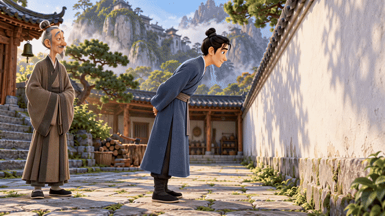

# 《劳山道士》｜幽默3D动画完整案例

把用户提供的《聊斋志异》故事骨架，转成原创角色的幽默3D动画短片。采用用户要求的皮克斯式动画美术方向；人物造型与资产为本项目生成，未使用既有电影角色。

[](video-preview.mp4)

上方动图是片段精选，点击观看完整720p预览；预览保留完整剪辑与音轨，降低分辨率和码率便于网页下载。

- [完整有声720p预览](video-preview.mp4)
- [原始2K成片（88.5秒）](https://github.com/zlbigger/story-video-director/releases/download/v1.1.0/laoshan-daoshi-2k.mp4)
- [完整公开项目包：11张图片、9段原视频、2K成片、剧本与提示词](https://github.com/zlbigger/story-video-director/releases/download/v1.1.0/laoshan-daoshi-public-project.zip)
- [全部美术图](06-asset-gallery.md) · [9段视频提示词](03-all-prompts.md) · [图像生成提示词](image-prompts/)

## 案例规格

| 项目 | 实际结果 |
| --- | --- |
| 图片生成 | gpt-image-2，经用户选择的OpenAI兼容本地网关；地址/鉴权不随案例公开 |
| 视频生成 | Metaso MiniMax-H3，多模态参考图模式 |
| 生成规划 | 9段×10秒，单段不超过15秒 |
| 素材 | 3张角色四视图、3张场景、5张关键帧 |
| 单段参考图 | 2—4张，每张含用途、继承属性、排除项与上传槽位 |
| 剪辑 | 88.5秒（01:28.5），第5段源out设为8.5秒，去掉提前起跑的重复 |
| 原始成片 | 2560×1440、24fps、H.264，AAC立体声48kHz |
| 原始素材时长 | 请求共90秒；服务返回单段容器时长约10.125秒，编辑按配方取舍 |
| 声音 | 保留生成音轨，无额外配乐、字幕或标题 |

## 故事与表演

王生入山求法，接到的却是一把斧头。几个月砍柴之后，他求到穿墙小术；山上轻巧成功，回家得意展示，一头撞墙。妻子先惊、再笑、再扶人，梦中师父一句训诫收尾。

梦中训诫按用户提供的改编版本保留，不宣称逐字复现原著。传术时加“莫存私心”，用具体行为连接自信与失败。撞墙采用轻微喜剧磕碰，无血、无伤口。

## 从故事到成片

1. 写场景卡、目标/障碍/策略及对白账本，先明确因果与听者反应。
2. 规划90秒，拆成9个10秒单位，为8处边界分别设计覆盖或时间地点切换。
3. 统一3D造型、服装、材质与光线，生成四视图；以角色锚与场景板作为关键帧输入。
4. 检查生成图，移除卧房额外出现的动物；将准备/完成关键帧分别作为构图参考。
5. 将真实文件绑定进每段唯一可复制提示词，使用`@filename.png`与上传槽位`@1`等一一对应。
6. 用H3多模态模式顺序生成；保留独立阶段任务状态以避免成功片段重复提交。
7. 以真实返回画面决定剪辑：第5段出现提前起跑，去掉最后1.5秒；保留全部原片，未用替代片段冒充。

## 制作文件

- [导演方案](00-director-brief.md) · [连续剧本与表演表](00-screenplay.md)
- [制作时间线](01-production-timeline.md) · [8处衔接计划](02-continuity-plan.md)
- [3D美术圣经](05-art-bible-3d.md) · [美术规格](04-asset-plan.md)
- [对白账本](dialogue-ledger.json) · [项目清单](project-manifest.json) · [API作业清单](api-jobs.json)
- [实际剪辑配方](edit-recipe.json) · [成片技术元数据](final-metadata.json) · [审核记录](video-qa.json)

## 验证范围与已知偏差

9段服务生成全部成功。技术检查包括完整解码、精确88.5秒、24fps共2124帧、音视频流、无超过0.1秒黑帧区间。逐段抽帧检查人物、穿墙、撞墙和8处切点。

**未完成正常速度带声整场验收，逐字台词、声线、口型及听觉衔接仍需人工复核。** 机器结构校验及静帧检查不能证明这些属性。

模型在第2段把柴墩也劈开，第8段妻子的笑容比剧本更明显。这是已生成的第一版，保留这些可观察偏差，展示实际结果而不是标称完全精修。

## 安全与复用

这是公开、离线展示副本。凭据、任务ID、运行日志、账户信息与私人绝对路径均不包含在公开文件或下载包中；API清单明确禁用付费提交。案例可直接查看，不需要密钥。

项目结构验证（只读，不触发付费任务）：

```bash
python3 story-video-director/scripts/validate_project.py examples/laoshan-daoshi
python3 story-video-director/scripts/metaso_h3_video.py examples/laoshan-daoshi --dry-run --no-assemble
```

若需重新生成，先复制到私人工作目录，改写自己的故事/美术/素材，重新验证，明确授权后再启用作业并通过本地环境配置凭据；不要运行公开案例来无意重复扣费。

本案例原创文档与生成媒体作为本仓库展示案例按[仓库MIT许可](../../LICENSE)提供；不包含外部作品、角色或商标的授权，也不保证第三方生成结果具有排他版权。
